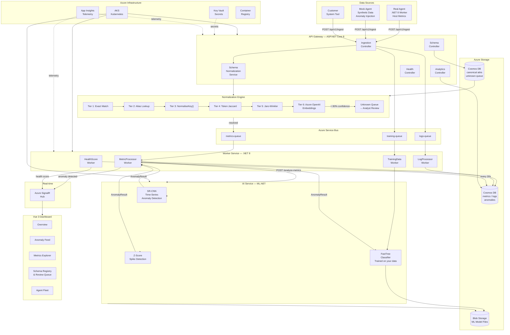

```mermaid
flowchart TB
    subgraph Sources["Data Sources"]
        A1[Real Agent\n.NET 8 Worker\nHost Metrics]
        A2[Mock Agent\nSynthetic Data\nAnomaly Injection]
        A3[Customer\nSystem Tool]
    end

    subgraph Gateway["API Gateway — ASP.NET Core 8"]
        B1[Ingestion\nController]
        B2[Schema\nNormalization\nService]
        B3[Analytics\nController]
        B4[Schema\nController]
        B5[Health\nController]
    end

    subgraph NormEngine["Normalization Engine"]
        N1["Tier 1: Exact Match"]
        N2["Tier 2: Alias Lookup"]
        N3["Tier 3: NormaliseKey()"]
        N4["Tier 4: Token Jaccard"]
        N5["Tier 5: Jaro-Winkler"]
        N6["Tier 6: Azure OpenAI\nEmbeddings"]
        NQ["Unknown Queue\n→ Analyst Review"]
        N1 --> N2 --> N3 --> N4 --> N5 --> N6
        N6 -->|< 80% confidence| NQ
    end

    subgraph Queue["Azure Service Bus"]
        Q1[metrics-queue]
        Q2[logs-queue]
        Q3[training-queue]
    end

    subgraph Workers["Worker Service — .NET 8"]
        W1[MetricProcessor\nWorker]
        W2[LogProcessor\nWorker]
        W3[TrainingData\nWorker]
        W4[HealthScore\nWorker]
    end

    subgraph AI["AI Service — ML.NET"]
        M1[SR-CNN\nTime-Series\nAnomaly Detection]
        M2[FastTree\nClassifier\nTrained on your data]
        M3[Z-Score\nSpike Detection]
    end

    subgraph Storage["Azure Storage"]
        DB1[(Cosmos DB\nmetrics / logs\nanomalies)]
        DB2[(Cosmos DB\ncanonical attrs\nunknown queue)]
        DB3[(Blob Storage\nML Model Files)]
    end

    subgraph Realtime["Real-time"]
        S1[Azure SignalR\nHub]
    end

    subgraph Dashboard["Vue 3 Dashboard"]
        D1[Overview]
        D2[Anomaly Feed]
        D3[Metrics Explorer]
        D4[Schema Registry\n& Review Queue]
        D5[Agent Fleet]
    end

    subgraph Infra["Azure Infrastructure"]
        I1[AKS\nKubernetes]
        I2[Key Vault\nSecrets]
        I3[App Insights\nTelemetry]
        I4[Container\nRegistry]
    end

    A1 & A2 & A3 -->|POST /api/v1/ingest| B1
    B1 --> B2
    B2 --> NormEngine
    NormEngine -->|resolved| Q1
    B1 --> Q2
    B1 --> Q3

    Q1 --> W1
    Q2 --> W2
    Q3 --> W3

    W1 -->|POST /analyze-metrics| AI
    AI --> M1 & M2 & M3
    M1 & M2 & M3 -->|AnomalyResult| W1

    W1 & W2 --> DB1
    W3 --> M2
    M2 --> DB3
    W4 -->|every 30s| DB1

    B3 --> DB1
    B4 --> DB2

    W1 -->|anomaly detected| S1
    W4 -->|health score| S1
    S1 --> Dashboard

    DB2 --> NormEngine
    AI --> DB3

    I1 --> Gateway & Workers & AI
    I2 -.->|secrets| Gateway
    I3 -.->|telemetry| Gateway & Workers
```
